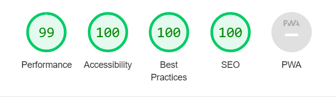

  <h3 align="center">QR Code Component</h3>

  

     QR Code Component based on frontend mentor design..
     
     
    <a href="https://piqon.github.io/QRCode/">View a project demo</a>
  

## Lighthouse Statistics

<!-- TABLE OF CONTENTS -->

  
Table of Contents

  <ol>
    <li>
      <a href="#about-the-project">About The Project</a>
      <ul>
        <li><a href="#built-with">Built With</a></li>
      </ul>
    </li>
    <li>
      <a href="#getting-started">Getting Started</a>
      <ul>
        <li><a href="#installation">Installation</a></li>
      </ul>
    </li>
  </ol>

<!-- ABOUT THE PROJECT -->

## About The Project

Scan the QR code and see where it will take you.

(<a href="#readme-top">back to top</a>)

### Built With

Technologies used:

- 
- 

(<a href="#readme-top">back to top</a>)

<!-- GETTING STARTED -->

## Getting Started

Open a index.html to look at project.

(<a href="#readme-top">back to top</a>)

